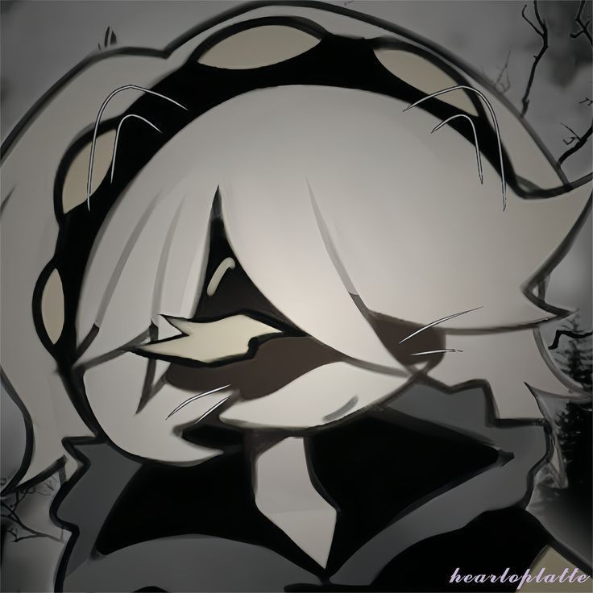

## Обо мне

Здравия желаю господа
Меня зовут Глеб и мне 16 лет.

Занимаюсь программированием 2 года в моде Mappet (Javascript) для Minecraft.

~~Занимаюсь над своим проектом который, с очень большим трудом делается~~.  
Сейчас занимаюсь над другим проектом который гораздо легче и не такой глобальный.

А потом доделаю и его.

Что я еще умею:
* Умею но не как профи моделировать в BlockBench.
* Примерно хорошо умею анимировать, к примеру модели игроков в Майнкрафте.
* В рисовании текстур еще учусь.

А еще я крайне не люблю ссоры и конфликты.

~~Немного одержим проектами~~
